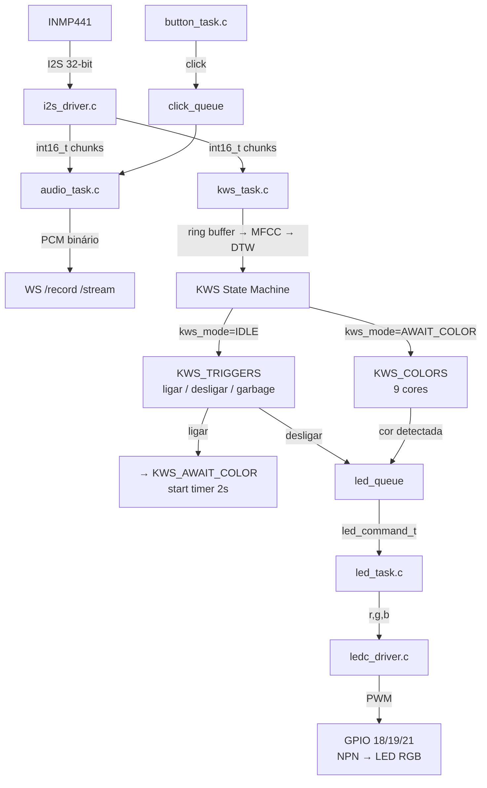

# RGB LED + KWS — Design

**Spec**: `.specs/features/rgb-led-kws/spec.md`
**Status**: Draft

---

## Architecture Overview



---

## Estrutura de Arquivos

```
firmware/main/
├── app_main.c              # init (NVS/GPIO/I2S/Wi-Fi/HTTP) + xTaskCreate
├── app_state.h             # extern de todos os handles e estado global
├── tasks/
│   ├── audio_task.c/.h     # APP_RECORDING / APP_STREAMING + WS handlers
│   ├── kws_task.c/.h       # KWS state machine + WS monitor handler
│   ├── button_task.c/.h    # debounce + click_queue
│   └── led_task.c/.h       # consome led_queue → ledc_driver
├── drivers/
│   ├── i2s_driver.c/.h     # i2s_init() + i2s_read_16bit()
│   └── ledc_driver.c/.h    # ledc_driver_init() + ledc_set_color()
├── kws/
│   ├── mfcc.c/.h           # sem mudanças
│   ├── dtw.c/.h            # sem mudanças
│   ├── templates.h         # REESTRUTURADO: KWS_TRIGGERS + KWS_COLORS
│   └── color_catalog.h     # NOVO: tabela {nome, r, g, b}
└── CMakeLists.txt
```

---

## Code Reuse Analysis

### Componentes Existentes Aproveitados

| Componente | Localização atual | Como aproveitar |
|------------|-------------------|-----------------|
| `mfcc_compute()` | `main/mfcc.c` | Mover para `kws/`, interface inalterada |
| `dtw_distance()` | `main/dtw.c` | Mover para `kws/`, interface inalterada |
| `i2s_init()` / `i2s_read_16bit()` | inline em `poc-microfone.c` | Extrair para `drivers/i2s_driver.c` |
| `button_task()` | inline em `poc-microfone.c` | Extrair para `tasks/button_task.c` |
| `audio_task()` | inline em `poc-microfone.c` | Extrair para `tasks/audio_task.c` |
| `kws_task()` | inline em `poc-microfone.c` | Extrair + adicionar state machine |
| `KWS_WORDS[]` / `kws_word_t` | `main/templates.h` | Reestruturar em dois arrays (ver abaixo) |
| `g_ws_mutex`, `g_click_queue`, fds | globals em `poc-microfone.c` | Mover para `app_state.h` como extern |

### Pontos de Integração

| Sistema | Método de integração |
|---------|----------------------|
| HTTP/WS handlers | Cada task file exporta `void X_register_handlers(httpd_handle_t)` |
| Estado KWS → LED | `QueueHandle_t g_led_queue` declarada em `app_state.h`, enviada por `kws_task`, consumida por `led_task` |
| LEDC → GPIO | `ledc_driver.c` encapsula toda a configuração; `led_task` só chama `ledc_set_color(r, g, b)` |

---

## Componentes

### `drivers/ledc_driver.c/.h`

- **Propósito**: Inicializar LEDC e expor API para setar cor RGB
- **Interfaces**:
  ```c
  void ledc_driver_init(void);
  void ledc_set_color(uint8_t r, uint8_t g, uint8_t b);
  ```
- **Configuração interna**:
  ```c
  // Timer 0: low speed, 8-bit, 5 kHz
  ledc_timer_config_t timer = {
      .speed_mode      = LEDC_LOW_SPEED_MODE,
      .duty_resolution = LEDC_TIMER_8_BIT,
      .timer_num       = LEDC_TIMER_0,
      .freq_hz         = 5000,
      .clk_cfg         = LEDC_AUTO_CLK,
  };

  // Canais: CH0=R(GPIO18), CH1=G(GPIO19), CH2=B(GPIO21)
  ```
- **`ledc_set_color` internamente**:
  ```c
  ledc_set_duty(LEDC_LOW_SPEED_MODE, LEDC_CHANNEL_0, r);
  ledc_update_duty(LEDC_LOW_SPEED_MODE, LEDC_CHANNEL_0);
  // idem para G e B
  ```
- **Dependências**: `driver/ledc.h`, `esp_driver_ledc` no CMakeLists

---

### `tasks/led_task.c/.h`

- **Propósito**: Task FreeRTOS que consome `g_led_queue` e aplica cor via `ledc_set_color`
- **Interfaces**:
  ```c
  typedef struct {
      uint8_t r, g, b;
  } led_command_t;

  void led_task(void *arg);  // arg não usado, lê g_led_queue de app_state.h
  ```
- **Comportamento**:
  - Bloqueia em `xQueueReceive(g_led_queue, &cmd, portMAX_DELAY)`
  - Ao receber: chama `ledc_set_color(cmd.r, cmd.g, cmd.b)`
  - Sem lógica de estado — apenas aplica o que recebe
- **Stack size**: 2048 bytes (sem computação pesada)
- **Dependências**: `ledc_driver.h`, `app_state.h`

---

### KWS State Machine (em `tasks/kws_task.c`)

**Estados:**
```c
typedef enum {
    KWS_IDLE,
    KWS_AWAIT_COLOR,
} kws_mode_t;
```

**Tabela de transições:**

| Estado atual | Detecção | Ação | Próximo estado |
|---|---|---|---|
| KWS_IDLE | "ligar" | salva `color_timeout_tick = now` | KWS_AWAIT_COLOR |
| KWS_IDLE | "desligar" | envia `{0,0,0}` para `g_led_queue` | KWS_IDLE |
| KWS_IDLE | "garbage" / nenhum | — | KWS_IDLE |
| KWS_AWAIT_COLOR | cor válida | envia `{r,g,b}` da `COLOR_CATALOG` | KWS_IDLE |
| KWS_AWAIT_COLOR | "ligar" | reinicia `color_timeout_tick = now` | KWS_AWAIT_COLOR |
| KWS_AWAIT_COLOR | "desligar" | envia `{0,0,0}` | KWS_IDLE |
| KWS_AWAIT_COLOR | timeout 2s | — | KWS_IDLE |

**Lógica de comparação por modo:**
- `KWS_IDLE`: compara contra `KWS_TRIGGERS[]` (ligar, desligar, garbage)
- `KWS_AWAIT_COLOR`: compara contra `KWS_COLORS[]` (9 cores); se melhor dist > threshold, compara também contra "ligar" e "desligar" do `KWS_TRIGGERS[]` para capturar esses dois casos especiais

**Timer via FreeRTOS tick:**
```c
// Ao entrar em AWAIT_COLOR:
TickType_t color_timeout_tick = xTaskGetTickCount();

// Em cada iteração em AWAIT_COLOR:
if ((xTaskGetTickCount() - color_timeout_tick) > pdMS_TO_TICKS(2000)) {
    kws_mode = KWS_IDLE;
}
```

**Buffers internos** (static em kws_task.c, não em app_state.h):
```c
static int16_t s_kws_ring[MFCC_WIN_SAMPLES];   // 16 KB
static int     s_kws_ring_pos = 0;
static float   s_mfcc_out[MFCC_N_FRAMES * MFCC_N_COEFS]; // 2.5 KB
```

---

### `kws/templates.h` — Reestruturação

Estrutura atual tem um único `KWS_WORDS[]`. Nova estrutura com dois arrays:

```c
// Palavras de trigger — verificadas em KWS_IDLE (e parcialmente em AWAIT_COLOR)
extern const kws_word_t KWS_TRIGGERS[];
extern const int        KWS_N_TRIGGERS;  // ligar, desligar, garbage = 3

// Palavras de cor — verificadas em KWS_AWAIT_COLOR
extern const kws_word_t KWS_COLORS[];
extern const int        KWS_N_COLORS;    // 9 cores
```

O script `training/generate_templates.py` precisará ser atualizado para gerar os dois arrays separados.

---

### `kws/color_catalog.h` — Novo

```c
typedef struct {
    const char *name;
    uint8_t     r, g, b;
} color_entry_t;

static const color_entry_t COLOR_CATALOG[] = {
    {"vermelho", 255,   0,   0},
    {"verde",      0, 255,   0},
    {"azul",       0,   0, 255},
    {"amarelo",  255, 255,   0},
    {"ciano",      0, 255, 255},
    {"magenta",  255,   0, 255},
    {"laranja",  255, 165,   0},
    {"roxo",     128,   0, 128},
    {"branco",   255, 255, 255},
};
static const int COLOR_CATALOG_SIZE = 9;

// Lookup por nome — retorna false se não encontrado
static inline bool color_lookup(const char *name, uint8_t *r, uint8_t *g, uint8_t *b) {
    for (int i = 0; i < COLOR_CATALOG_SIZE; i++) {
        if (strcmp(COLOR_CATALOG[i].name, name) == 0) {
            *r = COLOR_CATALOG[i].r;
            *g = COLOR_CATALOG[i].g;
            *b = COLOR_CATALOG[i].b;
            return true;
        }
    }
    return false;
}
```

---

### `app_state.h`

Declara (não define) todo estado compartilhado entre tasks. Definições ficam em `app_main.c`.

```c
#pragma once
#include "freertos/FreeRTOS.h"
#include "freertos/queue.h"
#include "freertos/semphr.h"
#include "esp_http_server.h"
#include "tasks/led_task.h"   // led_command_t

typedef enum { APP_IDLE, APP_RECORDING, APP_STREAMING } app_state_t;

extern volatile app_state_t  g_app_state;
extern volatile float        g_dtw_threshold;
extern bool                  g_kws_paused;

extern int g_ws_record_fd;
extern int g_ws_stream_fd;
extern int g_ws_monitor_fd;

extern SemaphoreHandle_t g_ws_mutex;
extern QueueHandle_t     g_click_queue;
extern QueueHandle_t     g_led_queue;     // novo
```

---

### `app_main.c` — Slim

```c
void app_main(void) {
    // 1. NVS flash init
    // 2. Mutex + queues (click_queue, led_queue)
    // 3. i2s_driver_init()
    // 4. ledc_driver_init()         ← novo
    // 5. gpio_init() (botão)
    // 6. wifi_init()
    // 7. vTaskDelay 3s
    // 8. server = start_webserver()
    //    audio_task_register_handlers(server)
    //    kws_task_register_handlers(server)
    // 9. xTaskCreate: button_task, audio_task, kws_task, led_task
}
```

---

## Data Models

### `led_command_t`
```c
typedef struct {
    uint8_t r, g, b;
} led_command_t;
```
Passada por valor via queue. Tamanho: 3 bytes (alinhado para 4 pelo FreeRTOS).

---

## CMakeLists.txt

```cmake
idf_component_register(
  SRCS
    "app_main.c"
    "tasks/audio_task.c"
    "tasks/kws_task.c"
    "tasks/button_task.c"
    "tasks/led_task.c"
    "drivers/i2s_driver.c"
    "drivers/ledc_driver.c"
    "kws/mfcc.c"
    "kws/dtw.c"
  INCLUDE_DIRS "." "tasks" "drivers" "kws"
  REQUIRES
    driver esp_wifi esp_event esp_netif nvs_flash esp_http_server
  PRIV_REQUIRES
    esp_driver_gpio esp_driver_i2s esp_driver_ledc
)
```

---

## Error Handling Strategy

| Cenário | Tratamento | Impacto |
|---------|------------|---------|
| `ledc_driver_init` falha | `ESP_ERROR_CHECK` — panic no boot | Boot não completa; detectável imediatamente |
| `g_led_queue` cheia | `xQueueSend` com timeout 0 — descarta silenciosamente | LED pode atrasar 1 ciclo; aceitável |
| Cor não encontrada em `COLOR_CATALOG` | Log de warning, sem envio à queue | LED não muda; comportamento seguro |
| Wi-Fi cai | LED mantém estado atual (independente) | Nenhum |
| Timeout KWS_AWAIT_COLOR | Retorna a KWS_IDLE sem mudar LED | Comportamento esperado |

---

## Decisões Técnicas

| Decisão | Escolha | Rationale |
|---------|---------|-----------|
| Resolução LEDC | 8 bits (0–255) | Compatível com o catálogo Arduino do protótipo |
| Frequência PWM | 5 kHz | Acima do limiar auditivo; imperceptível |
| Speed mode LEDC | `LEDC_LOW_SPEED_MODE` | Único modo disponível no ESP32 original |
| Timer do timeout 2s | `xTaskGetTickCount()` delta | Sem alocação extra; já usado no cooldown do KWS |
| Buffers KWS (ring, mfcc_out) | `static` em `kws_task.c` | Não são compartilhados; manter fora de `app_state.h` |
| `led_command_t` via queue | Por valor (3 bytes) | Sem ponteiros/heap; seguro entre tasks |
| Templates: dois arrays | `KWS_TRIGGERS[]` + `KWS_COLORS[]` | Permite comparação seletiva por modo sem condicional inline |

---

## Ordem de Implementação Sugerida

1. **Refatoração estrutural** (mover arquivos, criar dirs, atualizar CMakeLists) — compila sem funcionalidade nova
2. **`ledc_driver.c` + `led_task.c`** — testável isoladamente (enviar comando direto na queue)
3. **`color_catalog.h`** — sem código, só dados
4. **Reestruturar `templates.h`** — atualizar `generate_templates.py` para emitir dois arrays
5. **Gravar templates das 9 cores + desligar** — treinamento
6. **Máquina de estados KWS** — integração final