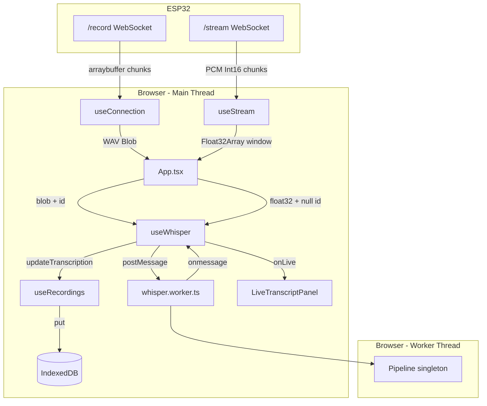

# Speech Recognition — Design

**Spec:** `.specs/features/speech-recognition/spec.md`
**Status:** Draft

---

## Architecture Overview

Todo o processamento roda no browser. O Web Worker isola a inferência Whisper da UI thread. Dois fluxos de áudio (pós-gravação e streaming ao vivo) convergem para o mesmo worker via mensagens tipadas.



---

## Code Reuse Analysis

### Existing Components a Aproveitar

| Component | Localização | Como usar |
|-----------|------------|-----------|
| `useRecordings` | `src/hooks/useRecordings.ts` | Adicionar `updateTranscription` + retornar `id` em `addRecording` |
| `db.ts` | `src/lib/db.ts` | Adicionar `updateTranscription(db, id, text)` |
| `RecordingItem` | `src/components/RecordingItem.tsx` | Adicionar exibição de `transcription` e estado "Transcrevendo..." |
| `App.tsx` | `src/App.tsx` | Adicionar select de idioma, wire `useWhisper` + `useStream` |
| `useConnection` | `src/hooks/useConnection.ts` | Sem mudança — callback `onRecordingSaved` já existe |

### Integration Points

| Sistema | Método |
|---------|--------|
| IndexedDB | `db.updateTranscription` via `useRecordings.updateTranscription` |
| Transformers.js | Web Worker com singleton pattern + message protocol |
| `/stream` WebSocket | Novo hook `useStream` (mesmo IP, segundo socket) |

---

## Components

### `whisper.worker.ts`

- **Purpose:** Singleton do pipeline Whisper; processa jobs de transcrição sequencialmente
- **Location:** `src/workers/whisper.worker.ts`
- **Interfaces:**

```typescript
// Main → Worker
type TranscribeRequest = {
  type: 'transcribe'
  id: string | null          // null = job de streaming (sem persistência)
  audio: Float32Array        // amostras normalizadas [-1, 1] a 16kHz
  language: string           // nome completo: 'portuguese', 'english', etc.
}

// Worker → Main
type WorkerMessage =
  | { status: 'initiate'; file: string }
  | { status: 'progress'; file: string; progress: number }
  | { status: 'done'; file: string }
  | { status: 'ready' }
  | { status: 'complete'; id: string | null; text: string }
  | { status: 'error'; id: string | null; error: string }
```

- **Dependencies:** `@huggingface/transformers`
- **Pattern:**
```typescript
class WhisperPipeline {
  static instance: Promise<AutomaticSpeechRecognitionPipeline> | null = null

  static getInstance(progress_callback: ProgressCallback) {
    this.instance ??= pipeline(
      'automatic-speech-recognition',
      'onnx-community/whisper-tiny',
      { progress_callback, dtype: 'fp32' }
    )
    return this.instance
  }
}

self.addEventListener('message', async ({ data }: MessageEvent<TranscribeRequest>) => {
  const transcriber = await WhisperPipeline.getInstance(p => self.postMessage(p))
  try {
    const result = await transcriber(
      { input: data.audio, sampling_rate: 16000 },
      { language: data.language, task: 'transcribe' }
    )
    self.postMessage({ status: 'complete', id: data.id, text: result.text.trim() })
  } catch (e) {
    self.postMessage({ status: 'error', id: data.id, error: String(e) })
  }
})
```

> **Nota:** Usar `onnx-community/whisper-tiny` (versão ONNX quantizada) em vez de `openai/whisper-tiny` — compatível com Transformers.js v3 sem conversão manual.

---

### `useWhisper`

- **Purpose:** Gerencia o Web Worker, fila de jobs, estado do modelo e resultado
- **Location:** `src/hooks/useWhisper.ts`
- **Interfaces:**

```typescript
type UseWhisperOptions = {
  language: string                                   // ISO code: 'pt', 'en', etc.
  onComplete: (id: string, text: string) => void    // callback pós-gravação
  onLive: (text: string) => void                    // callback streaming ao vivo
}

type UseWhisperReturn = {
  modelStatus: 'idle' | 'loading' | 'ready'
  transcribingIds: Set<string>
  transcribe: (id: string, blob: Blob) => void       // pós-gravação
  transcribeLive: (audio: Float32Array) => void      // streaming
}
```

- **Comportamento interno:**
  1. Cria worker uma vez via `useRef` no `useEffect`
  2. `transcribe(id, blob)`: decode WAV via `AudioContext.decodeAudioData` → `Float32Array` → enfileira job
  3. `transcribeLive(audio)`: enfileira job com `id: null`
  4. Fila processada sequencialmente (um job por vez): `worker.postMessage({ audio }, [audio.buffer])`
  5. `onmessage` despacha por `status`

- **Dependencies:** `useRef`, `useEffect`, `useState`, `useCallback`

---

### `useStream`

- **Purpose:** WebSocket para `/stream`, acumulação de chunks PCM e VAD simples
- **Location:** `src/hooks/useStream.ts`
- **Interfaces:**

```typescript
type UseStreamReturn = {
  streaming: boolean
  connectStream: (ip: string) => void
  disconnectStream: () => void
}
```

- **Comportamento interno:**
  1. WebSocket para `ws://<ip>/stream`, `binaryType = 'arraybuffer'`
  2. Acumula chunks `Int16Array` em `bufferRef`
  3. A cada chunk, calcula RMS dos últimos 512 samples
  4. Flush quando: buffer ≥ 64000 samples (4s a 16kHz) OU (buffer ≥ 8000 samples E RMS < 200)
  5. Na flush: converte `Int16 → Float32` (divide por 32768), chama `onWindow(float32)`
  6. `onWindow` vem de prop → `useWhisper.transcribeLive`

- **VAD threshold:** 200 (RMS de Int16, empiricamente ~silêncio; ajustar em runtime)

---

### `LiveTranscriptPanel`

- **Purpose:** Exibe transcrição ao vivo durante streaming
- **Location:** `src/components/LiveTranscriptPanel.tsx`
- **Interfaces:**

```typescript
type Props = {
  text: string      // texto acumulado da sessão de streaming
  active: boolean   // streaming está conectado
}
```

- **Reuses:** Estilos existentes do projeto (inline style pattern já usado nos outros componentes)

---

### `LanguageSelect`

- **Purpose:** Select de idioma passado ao pipeline
- **Location:** `src/components/LanguageSelect.tsx`
- **Interfaces:**

```typescript
type Props = {
  value: LanguageCode
  onChange: (code: LanguageCode) => void
}

type LanguageCode = 'pt' | 'en' | 'es' | 'fr' | 'de'

const LANGUAGES: Record<LanguageCode, string> = {
  pt: 'Português',
  en: 'English',
  es: 'Español',
  fr: 'Français',
  de: 'Deutsch',
}

// Mapa para nome completo aceito pelo Whisper
const WHISPER_LANG: Record<LanguageCode, string> = {
  pt: 'portuguese',
  en: 'english',
  es: 'spanish',
  fr: 'french',
  de: 'german',
}
```

---

## Data Models

### Recording (atualizado)

```typescript
// src/types.ts
export interface Recording {
  id: string
  name: string
  timestamp: number
  duration: number
  size: number
  blob: Blob
  transcription?: string   // adicionado — undefined = ainda não transcrito
}
```

> IndexedDB não requer migração de schema — `put()` persiste campos extras automaticamente. Versão do DB permanece `1`.

### db.ts (nova função)

```typescript
export function updateTranscription(db: IDBDatabase, id: string, text: string): Promise<void> {
  return new Promise((resolve, reject) => {
    const tx = db.transaction('recordings', 'readwrite')
    const store = tx.objectStore('recordings')
    const req = store.get(id)
    req.onsuccess = () => {
      const rec = req.result
      if (rec) store.put({ ...rec, transcription: text })
      resolve()
    }
    req.onerror = () => reject(req.error)
  })
}
```

### useRecordings (mudanças)

```typescript
// addRecording agora retorna o id
addRecording(blob: Blob, duration: number): Promise<string>

// nova função exposta
updateTranscription(id: string, text: string): Promise<void>
```

---

## Wiring em App.tsx

```typescript
const [language, setLanguage] = useState<LanguageCode>('pt')
const [liveText, setLiveText] = useState('')

const { recordings, addRecording, updateTranscription } = useRecordings()
const { transcribe, transcribeLive, modelStatus, transcribingIds } = useWhisper({
  language: WHISPER_LANG[language],
  onComplete: updateTranscription,
  onLive: (text) => setLiveText(prev => prev + ' ' + text),
})
const { streaming, connectStream, disconnectStream } = useStream({
  onWindow: transcribeLive,
})
const { state, error, connect, disconnect } = useConnection(
  async (blob, duration) => {
    const id = await addRecording(blob, duration)
    transcribe(id, blob)
  }
)
```

---

## Error Handling Strategy

| Cenário | Tratamento | Impacto no usuário |
|---------|-----------|-------------------|
| Pipeline Whisper lança exceção | Worker envia `{ status: 'error' }` → hook ignora transcrição | Gravação salva sem texto |
| AudioContext.decodeAudioData falha | try/catch no hook, job pulado | Gravação salva sem texto |
| WAV < 0.5s (muito curto para Whisper) | Verificar duração antes de enfileirar | Sem tentativa, sem erro visível |
| WASM não suportado | Pipeline.getInstance rejeita → banner de erro permanente | "Reconhecimento não suportado neste browser" |
| IndexedDB falha ao salvar transcrição | try/catch em updateTranscription | Gravação existe, transcrição perdida |

---

## Tech Decisions

| Decisão | Escolha | Rationale |
|---------|---------|-----------|
| Modelo | `onnx-community/whisper-tiny` | Versão ONNX quantizada (~40MB), compatível com Transformers.js v3 sem config extra |
| Worker instanciação | `new Worker(new URL(...), { type: 'module' })` | Padrão Vite para TypeScript workers, sem plugin extra |
| Transferência de áudio | `postMessage(msg, [audio.buffer])` (transferable) | Zero-copy — evita cópia de Float32Array grande |
| DB versão | Mantém `1` | `transcription` é campo opcional; IndexedDB persiste campos extras sem migração |
| Vite config | `optimizeDeps.exclude: ['@huggingface/transformers']` | Evita que Vite tente pre-bundlizar o pacote (usa WASM dinâmico internamente) |
| Fila de jobs | Array em `useRef` dentro de `useWhisper` | Whisper não é re-entrante; evita múltiplas inferências simultâneas |

---

## Arquivos a criar/modificar

### Criar
- `web/src/workers/whisper.worker.ts`
- `web/src/hooks/useWhisper.ts`
- `web/src/hooks/useStream.ts`
- `web/src/components/LiveTranscriptPanel.tsx`
- `web/src/components/LanguageSelect.tsx`

### Modificar
- `web/src/types.ts` — `transcription?: string` em `Recording`
- `web/src/lib/db.ts` — adicionar `updateTranscription`
- `web/src/hooks/useRecordings.ts` — `addRecording` retorna `string`; expor `updateTranscription`
- `web/src/App.tsx` — wire todos os hooks, add `LanguageSelect`, add `LiveTranscriptPanel`
- `web/src/components/RecordingItem.tsx` — exibir transcrição + estado "Transcrevendo..."
- `web/vite.config.ts` — `optimizeDeps.exclude`
- `web/package.json` — adicionar `@huggingface/transformers`
